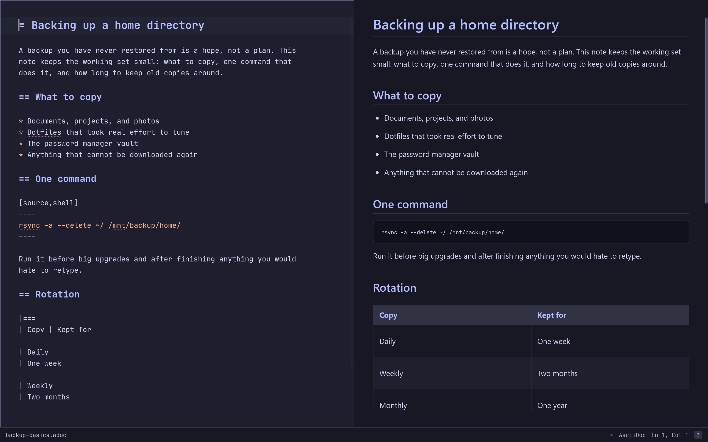
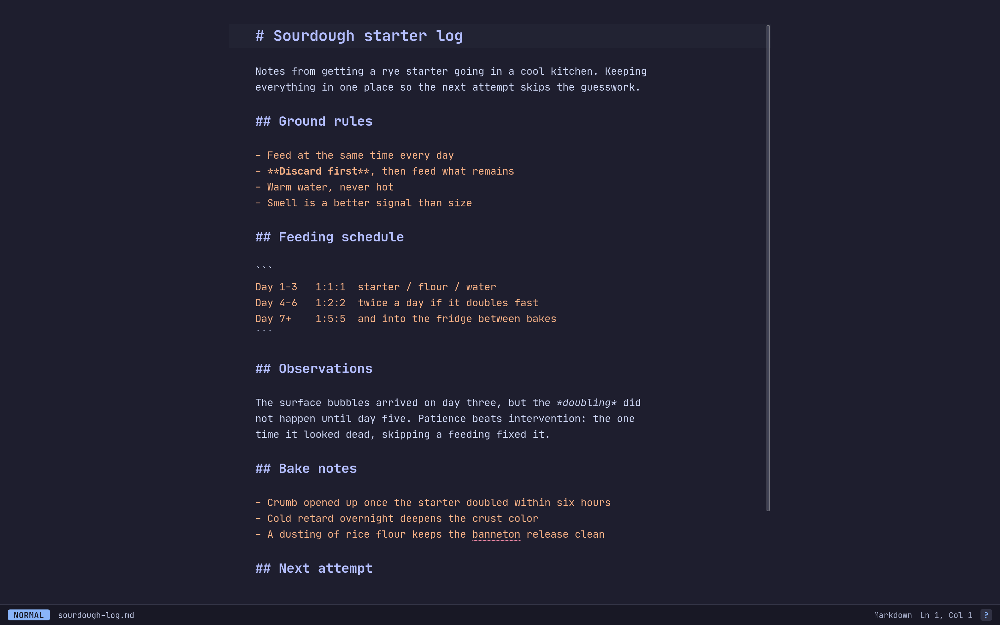
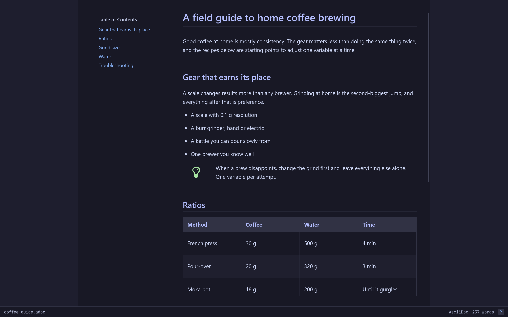

= Skrivro
:experimental:

_Keyboard-first AsciiDoc and Markdown editor with live preview._

image:https://img.shields.io/github/actions/workflow/status/jprostko/skrivro/release.yml?label=CI[CI,link=https://github.com/jprostko/skrivro/actions/workflows/release.yml]
image:https://img.shields.io/github/v/release/jprostko/skrivro?label=release[Latest release,link=https://github.com/jprostko/skrivro/releases/latest]
image:https://img.shields.io/github/downloads/jprostko/skrivro/total?label=downloads[Downloads,link=https://github.com/jprostko/skrivro/releases]
image:https://img.shields.io/badge/Tauri-2-24C8DB?logo=tauri&logoColor=white[Tauri 2,link=https://tauri.app]
image:https://img.shields.io/badge/Rust-stable-b7410e?logo=rust[Rust stable]
image:https://img.shields.io/badge/license-0BSD-blue[License: 0BSD,link=LICENSE]

Skrivro is a desktop application for writing AsciiDoc and Markdown documents with side-by-side live preview.
It's built around keyboard-driven workflows (with optional Vim mode), runs as a native Tauri application on Linux, macOS, and Windows, and ships small. The WebKit-based binary is under 20 MB on Linux.

A limited single-file HTML build of Skrivro also exists on the `standalone` branch, browser-based, for locked-down environments where installing native software isn't an option. It necessarily gives up the features that depend on a native app. The `standalone` branch documents what differs.

== Minimum OS versions

*macOS* (Apple Silicon)

image:https://img.shields.io/badge/macOS-26+-000000?logo=apple[macOS 26+]
image:https://img.shields.io/badge/Apple_Silicon-arm64-000000?logo=apple[Apple Silicon arm64]

The app is unsigned, so macOS quarantines the download and reports it as damaged.
Clear the attribute once after installing (`xattr -dr com.apple.quarantine /Applications/Skrivro.app`), details in the link:docs/FAQ.adoc#macos-damaged[FAQ].

*Windows*

image:https://img.shields.io/badge/Windows-11+-0078D4[Windows 11+]

Windows needs the WebView2 runtime: Windows 11 ships with it, and
the installers fetch it in the unlikely case it is missing.
Also, the installers are unsigned, so SmartScreen interrupts each one's first run.
Click *More info*, then *Run anyway*. Details are in the link:docs/FAQ.adoc#windows-smartscreen[FAQ].

*Linux* (x86_64)

image:https://img.shields.io/badge/Ubuntu-24.04+-e95420?logo=ubuntu&logoColor=white[Ubuntu 24.04+]
image:https://img.shields.io/badge/Debian-13+-a81d33?logo=debian&logoColor=white[Debian 13+]
image:https://img.shields.io/badge/Fedora-current-51a2da?logo=fedora&logoColor=white[Fedora]
image:https://img.shields.io/badge/RHEL-10+_(EPEL)-ee0000?logo=redhat&logoColor=white[RHEL 10+ via EPEL]
image:https://img.shields.io/badge/Arch-rolling-1793d1?logo=archlinux&logoColor=white[Arch]

Linux additionally needs WebKitGTK 4.1 (libsoup 3): in distro repos
everywhere above except RHEL, where it comes from EPEL. The glibc
floor of release binaries is 2.39 (hence Ubuntu 24.04 / Debian 13 /
RHEL 10). Linux packages are currently x86_64 only.

== Screenshots

=== Split mode

=== Editor only (Vim mode)

=== Preview only

== Features

* *Live preview* for AsciiDoc and Markdown (GitHub Flavored, with task lists, alerts, and emoji shortcodes), updated as you type.
* *Three display modes:* editor only, split (editor + preview), or preview only.
* *Keyboard-first.* Every action has a shortcut.
Mouse and trackpad work everywhere they should, but the app is designed to be driven from the keyboard.
* *Optional Vim mode.* Motion, visual, replace, ex commands: the full Vim experience inside the editor pane.
* *Configurable* via a flat `skrivro.conf` file: fonts, padding, theme, default format, status bar style, soft column limits, session restore, spellcheck, and more. Every key is documented inline in the default config template.
* *Offline spellcheck.* Bundled US English plus user-supplied Swedish and other variants, with a personal word list and right-click suggestions.
* *Themes.* Seven bundled themes (five dark, including Catppuccin Mocha and Dracula, plus two light). User-supplied themes drop into a `themes/` directory and override bundled versions of the same name.
* *AsciiDoc include:: support.* Multi-file books and documentation projects work: `include::` directives are pre-expanded via the filesystem before Asciidoctor sees the source.
* *Scroll sync.* Snap the preview to the block under the editor cursor on demand. Sync-once, not continuous. Both panes stay independently scrollable until you ask for a sync.
* *Cross-platform.* Linux (X11 and Wayland, including tiling window managers), macOS (Apple Silicon), Windows.
* *Localized UI.* English and Swedish at present. Auto-detects from system locale, and can be forced via config.
* *Session restore.* On by default: reopens the file from your last session on launch. Set `restore-session = false` to start with a blank buffer instead.
* *File associations.* Double-click `.adoc` or `.md` files to open them in Skrivro.
* *Private by default.* The app itself makes no network requests: no telemetry, no phone-home, no update checks. The one thing that can reach out is external images in your preview, which load by default for convenience but can be blocked with `allow-external-images = false`. The CSP relaxation stays scoped strictly to images, so script, font, frame, and connect sources are always locked down.

== Getting started

Installers and packages for every platform are on the link:https://github.com/jprostko/skrivro/releases[releases page].
To build from source instead, clone this repository and run from its root:

[source,bash]
----
vp install
vp run tauri build
----

The built binary lands in `src-tauri/target/release/`.
On macOS and Windows the same build also produces installable bundles in `src-tauri/target/release/bundle/`: an app bundle and `.dmg` on macOS, NSIS and MSI installers on Windows.
Prerequisites (the Rust toolchain and Vite+), platform-specific system dependencies (webkit2gtk-4.1 on Linux, etc.), and packaging notes live in link:docs/BUILDING.adoc[].

== Documentation

[cols="1,3"]
|===
| link:docs/USAGE.adoc[USAGE.adoc]
| Keyboard shortcuts, Vim commands, modes, day-to-day workflow

| link:docs/CONFIG.adoc[CONFIG.adoc]
| `skrivro.conf` format, every key with examples

| link:docs/THEMING.adoc[THEMING.adoc]
| Theme system, bundled themes, authoring your own

| link:docs/BUILDING.adoc[BUILDING.adoc]
| Building from source, system dependencies, packaging

| link:docs/ARCHITECTURE.adoc[ARCHITECTURE.adoc]
| High-level architecture, module breakdown, IPC pattern

| link:docs/CREDITS.adoc[CREDITS.adoc]
| Major incorporated projects and what they contribute

| link:docs/FAQ.adoc[FAQ.adoc]
| Common questions and troubleshooting
|===

== About this project

Skrivro was built primarily through AI pair-programming. Most of the code, and most of this documentation, came out of long iterative sessions between the original author and Anthropic's Claude model.
The author drove design decisions, tested every change, and made the final calls on what shipped. The model handled much of the keyboard work and architecture exploration.

This is worth disclosing up front because some readers reasonably evaluate code differently knowing how it was produced.
The codebase is reviewable: every commit has a substantive message explaining the *why*, the architecture is documented in link:docs/ARCHITECTURE.adoc[], and testing pairs a Vitest and cargo-test suite over the pure-logic layer with the author running the app to verify behavior. There is no CI pipeline.

*This is not a maintained open-source project in the traditional sense.*
It's published so that anyone who finds it useful can use it, audit it, or build on it under the 0BSD license, but the author doesn't plan to triage issues, review pull requests, or take feature requests.
The most likely path forward for someone who wants Skrivro to do something different is to fork it. The codebase is small and the architecture is documented enough that adapting it is realistic.

== License

0BSD. See link:LICENSE[] for the full text.
Third-party dependency licenses are aggregated in link:NOTICES[].
